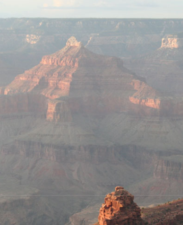
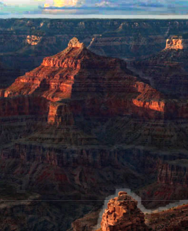
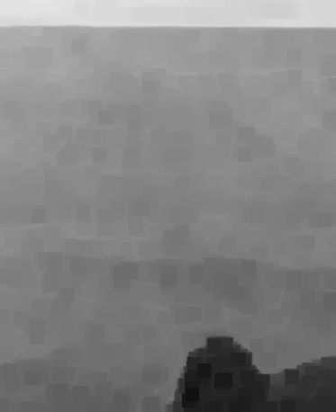
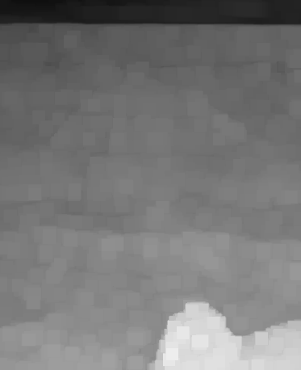

# Single Image Haze Removal

何恺明 去雾算法 2009 年 CVPR 最佳论文


### 论文解说

论文： 

http://mmlab.ie.cuhk.edu.hk/pdf/Single%20Image%20Haze%20Removal%20Using%20Dark%20Channel%20Prior.pdf

强推这位博主的解说，非常清晰，所以我不写了：）

[论文解说与C++实现](http://coderskychen.cn/2015/12/11/%E6%9A%97%E9%80%9A%E9%81%93%E5%8E%BB%E9%9B%BE%E7%AE%97%E6%B3%95%E7%9A%84C-%E5%AE%9E%E7%8E%B0%E4%B8%8E%E4%BC%98%E5%8C%96%EF%BC%88%E4%B8%80%EF%BC%89/)


### Python 实现

#### 0. 

```py
import cv2
import numpy as np
from scipy.ndimage.filters import minimum_filter
```

#### 1. dark channel

```py
# step 1: compute the dark channel
def dark_channel(im, patch_size=15):
    dark = minimum_filter(im, patch_size, mode='nearest')
    dark = np.min(dark, axis=2)
    return dark
```

#### 2. compute atmospheric light

大气光的计算，原论文没有用前 0.1% 的点做平均，上面博主的代码实现也没有用平均。但是我不用平均效果很差，还请高手指点一二。

```py
def atmospheric_light(im, dark, mean=True):
    # We first pick the top 0.1% brightest pixels in the dark channel.
    # Among these pixels, the pixels with highest intensity in the input 
    # image I is selected as the atmospheric light
    flat = dark.flatten()
    num = flat.shape[0] >> 10 # same as / 1024
    assert num >= 1
    indice = flat.argsort()[-num:]
    cols = dark.shape[1]
    xys = [(index // cols, index % cols) for index in indice]
    # In paper, author haven't say we should use average 
    # but in practice, average value yield better result
    if mean:
        points = np.array([im[xy] for xy in xys])
        airlight = points.mean(axis=0)
        return airlight
    xys = sorted(xys, key=lambda xy: sum(im[xy]), reverse=True)
    xy = xys[0]
    airlight = im[xy]
    return airlight
```

#### 3. estimating the transmission

```py
def estimate_transmission(im, airlight, patch_size=15):
    normal = im / airlight
    tx = 1 - 0.95 * dark_channel(normal, patch_size)
    return tx
```

原论文中，在这一步之后使用 soft matting 优化透射图 tx，但是这步比较麻烦，而且不影响看到最终结果。先跳过，后面补 :)

#### 4. Recovering the Scene Radiance

```py
def recover_scene(im, airlight, tx, t0=0.1):
    mtx = np.where(tx > t0, tx, t0)
    res = np.zeros_like(im, dtype=im.dtype)
    for i in range(3):
        c = (im[:, :, i] - airlight[i]) / mtx + airlight[i]
        c = np.where(c < 0, 0, c) 
        c = np.where(c > 255, 255, c)
        res[:, :, i] = c
    return res
```

#### 5. visualization

已经写完了，现在，依次可视化：

+ 原图
+ 暗通道
+ 透射图
+ 效果图

```py
def show(*ims):
    for (i, im) in enumerate(ims):
        cv2.imshow(f"im{i}", im) 
    cv2.waitKey(0)
    cv2.destroyAllWindows()
```

#### 6. pipeline

```py
if __name__ == '__main__':
    import sys
    if len(sys.argv) > 1:
        img = sys.argv[1]
    else:
        img = 'haze2.jpg'
    im = cv2.imread(img)
    patch_size = 15
    dark = dark_channel(im, patch_size)
    airlight = atmospheric_light(im, dark, True)
    tx = estimate_transmission(im, airlight, patch_size)
    dehaze = recover_scene(im, airlight, tx, 0.1)
    show(im, dark, tx, dehaze)
```

### 效果

依次为： 原图 效果图 暗通道 透射图

 

 
 
